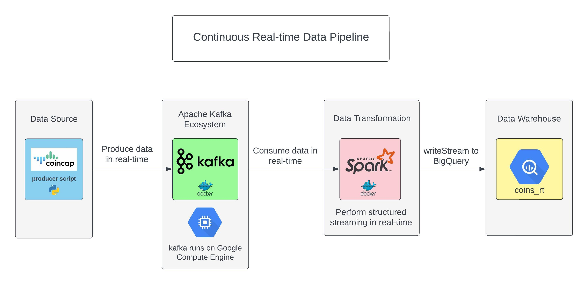

# Streaming Crypto Tokens in Real-Time

Real-time streaming of crypto tokens achieved using Kafka and Spark Structured Streaming, with seamless data warehousing integration.



## Table of Contents

* [Project Description](https://github.com/Jawakar/realtime_coins_stream#project-description)
* [Installation and Usage](https://github.com/Jawakar/realtime_coins_stream#installation-and-usage) 
* [Acknowledgements](https://github.com/Jawakar/realtime_coins_stream#acknowledgements) 
* [License](https://github.com/Jawakar/realtime_coins_stream#license)

## Project Description

This project showcases the utilisation of Kafka and Spark Structured Streaming to enable seamless real-time streaming of crypto tokens. Furthermore, the project also incorporates a data warehousing solution to store the streaming data, for further exploration and business intelligence purposes.

## Installation and Usage

To install and set up the project, please follow these steps:

1. Clone the repo, download the `requirements.txt` file, which contains the necessary Python dependencies. You can find it in the project repository.
2. Obtain GCP's free credits and start a VM instance. This instance will be used for running the project.
3. Use the provided `docker-compose.yml` file and replace "your_ip_address_here" with the actual IP address of your VM instance. This file will configure the necessary Docker containers for Kafka and other components.
4. Execute the following Docker commands to create a topic:

   ```
   docker exec -it kafka /bin/sh
   cd opt
   cd kafka_2.13-2.8.1
   ```
5. Create a Kafka topic by executing the following command, replacing `your_ip_address_here` with the appropriate IP address:

   ```
   ./bin/kafka-topics.sh --create --topic test_topic --bootstrap-server your_ip_address_here:9092 --replication-factor 1 --partitions 1`
   ```
6. To verify the topic creation, execute the following command:

   ```
   ./bin/kafka-topics.sh --list --bootstrap-server your_ip_address_here:9092
   ```
7. Create a producer to send messages to the topic:

   ```
   ./bin/kafka-console-producer.sh --topic test_topic --bootstrap-server your_ip_address_here:9092
   ```
8. Use the provided `producer.py` script to produce messages to the Kafka topic.
9. Download the required JAR files that enable writing to BigQuery and configure them accordingly.
10. Finally, use the `consume_and_stream.py` script to consume messages from Kafka and stream them to the desired destination.
11. Execute the following `spark-submit` command:

    ```
    spark-submit --packages org.apache.spark:spark-sql-kafka-0-10_2.12:3.3.2 consume_and_stream.py
    ```

Make sure to replace "your_ip_address_here" with the actual IP address of your VM instance throughout the steps.

Please note that these instructions assume a working knowledge of Docker and GCP's VM instances.

## Acknowledgements

This project was inspired by the following resources:

* [DataTalksClub/data-engineering-zoomcamp](https://github.com/DataTalksClub/data-engineering-zoomcamp/tree/main/week_6_stream_processing), [YouTube](https://www.youtube.com/watch?v=KerNf0NANMo&ab_channel=DarshilParmar): Provides valuable insights on Kafka, compute engine, and BigQuery.
* [YouTube: Kafka installation using Docker and Docker Compose](https://www.youtube.com/watch?v=WnlX7w4lHvM&t=7s&ab_channel=CodeWithRajRanjan): Offers step-by-step guidance on setting up Kafka using Docker.
* [Fixing Hadoop connectors](https://github.com/GoogleCloudDataproc/hadoop-connectors/issues/618): Provides troubleshooting assistance for Hadoop connectors.

## License

This project is licensed under the [MIT License](https://github.com/Jawakar/realtime_coins_stream/blob/main/LICENSE).
